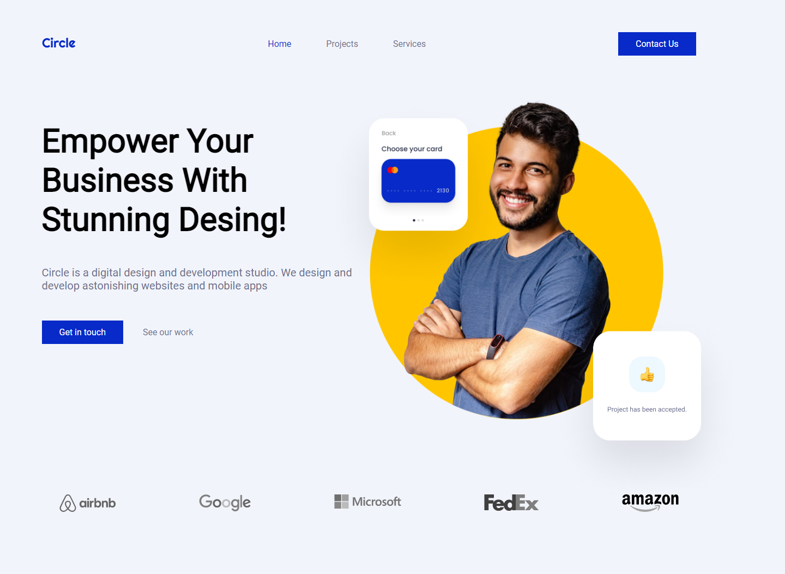

 

 
    
    <h3 align="center">Ironhack mid-term project</h3>
    

        <a href="https://ironhack-midtermproject.netlify.app">View Netlify deployed demo</a>
        ·
        <a href="https://docs.google.com/presentation/d/1zq5UCTGFmIwVCnoiHEO381wEek_5xUDc566gDatwlnE">View the presentation</a>
        ·
        <a href="https://raw.githubusercontent.com/ironhack-jc/mid-term-api/main/projects">View the API endpoint</a>
    

 

# Ironhack Mid-Term Project

Ironhack Frontend assignment project. The objective is to build and deploy a fictitious fully responsive Circle company website using technologies such as: HTML, CSS & JavaScript. Includes data fetching from an external Web API.

 

## About the project

Frontend Development of a website for a fictional Circle web design company, with responsive design in three sizes (mobile, tablet and desktop).

### Authors

|                     | Name                | GitHub              |
| :------------------ | :------------------ | :------------------ |
|  | **Albert** | [**@albertsanle**](https://github.com/albertsanle) |
|  | **Ester** | [**@Ester79**](https://github.com/Ester79)  |
| | **JA Reyes** | [**@jarDotNet**](https://github.com/jarDotNet) |

### Objectives

- Creation of several pages:
  - a home,
  - a “project” page and
  - a contact page with a form.
- Adding navigation between the pages.
- Making all the fields in the contact form required before being able to submit it.
- Adding animations to different sections (**bonus**).
- Get the first three projects of the [API](https://raw.githubusercontent.com/ironhack-jc/mid-term-api/main/projects). This API returns the projects in descending order, so the first item of the array is the last project.
- Validate the form using JavaScript. Show an alert if the name is equal to ironhack: "You cannot be Ironhack, because I am Ironhack". In addition, more filters can be added: incorrect email, required fields not set, etc.
- Create the "project" page dynamically:
  - **fetch** the API., using the *onload* event.
  - **filter** the project with uuid and print the name, description, content, image and completed_on in the expected position of the page.
  - *Other projects* should be other projects of the API. For example, if the project is filtered with uuid 1, other projects must be others. Take three other projects randomly (**bonus**).
  - If the project does not exist in the API, you should **alert** the user.
- Responsive menu. On click, toggle the menu (**bonus**).

### Project assets

For this project, we had access to the following assets:

- A [Figma](https://www.figma.com/file/bKFppfHiRq6xNedPILbRMu/mid-term-project) design that we had to turn into a live, responsive website. This design also includes a few specifications regarding fonts and colors.

- A folder with all the images needed for this project.

### Features

This project includes the following functionalities:

- Responsive web dessign
- Burger menu
- JavaScript Fetch API & dynamic pages generation
- Web components for the header, footer and newsletter
- Scroll to top button in the home page
- 404 Not Found error page
- CSS animations for the Scroll to top and the 404 error page
- Form validation
- Modal vanilla js window to show messages
- Favicon

### Built With

- 
- 
- 
- 
- 
- 
